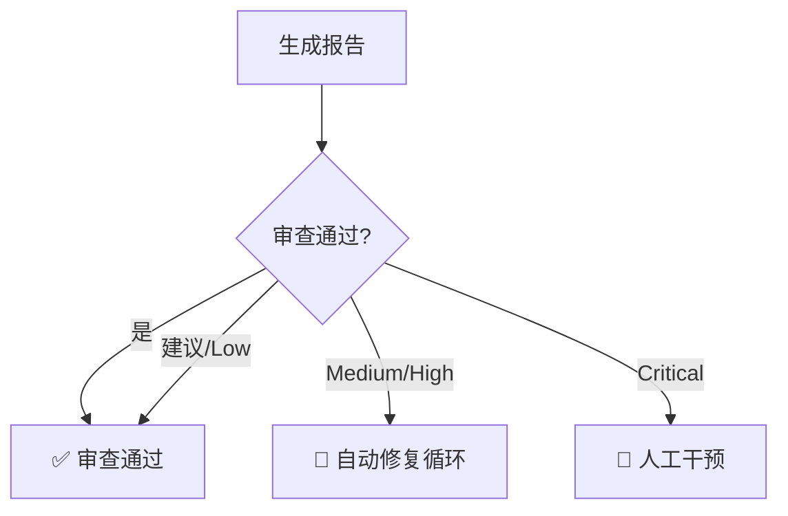

# 代码审查工作流

使用 GitHub Copilot (GPT-5.2-Codex) 和其他 AI 模型协助代码审查，自动修复问题，循环直到通过。

## 配置

```yaml
max_retries: 3              # 最大自动修复次数
auto_fix: true              # 是否自动修复
priority_threshold: medium  # 自动修复的最低问题级别
review_model: "GPT-5.2-Codex" # 默认 Copilot 审核模型
```

---

## 步骤 1: 收集变更文件

获取待审查的代码变更：
```bash
git diff --name-only main..HEAD
```

---

## 步骤 2: 调用审查工具 (GitHub Copilot CLI)

使用指定的模型进行深度审核：

### 2.1 Codex 审核 (GitHub Copilot)
**关注点**: 安全性、最佳实践、核心逻辑
```bash
# 使用指定的 Copilot 模型进行审核
gh copilot suggest "Review the current changes for security vulnerabilities (SQLi, XSS, CSRF) and design patterns. Use model $review_model."
```

### 2.2 并行辅助审核 (可选)
根据需要调用其他本地或 API 模型（如 Gemini, 智谱）关注特定维度：
- **架构设计**: Gemini
- **代码风格**: 智谱

---

## 步骤 3: 汇总问题与报告格式

收集所有反馈，并强制生成符合以下格式的报告：

1. **审核结论**：`通过 ✅` | `建议修改 ⚠️` | `拒绝 ❌ (需修复)`
2. **问题清单**：
   - **优先级**：🔴 Critical / 🟠 High / 🟡 Medium / 偏 Low
   - **位置**：文件路径及代码行号
   - **描述**：详细描述到底哪里有问题
3. **修复建议**：提供具体的重构方案或代码示例。
4. **网络查询建议**：针对技术难点提供搜索引擎关键词（格式：`Search: keyword1, keyword2`）。

---

## 步骤 4: 判断处理路径



---

## 步骤 5: 自动修复循环

**条件**: 存在 Medium 或 High 级别问题，且重试次数 < max_retries

1. **生成方案**: 根据修复建议生成代码。
2. **应用修复**: 修改文件。
3. **运行测试**: `php artisan test`。
4. **重新审查**: 返回步骤 2。

---

## 步骤 6: 人工干预与报告

如果自动修复失败或发现 Critical 问题，生成详细的人工干预报告，格式同步骤 3。

---

## 产出

- ✅ 标准化审查报告 (含修复建议与搜索关键词)
- ✅ 自动修复后的稳定代码
- ✅ 完整的审查审计日志
