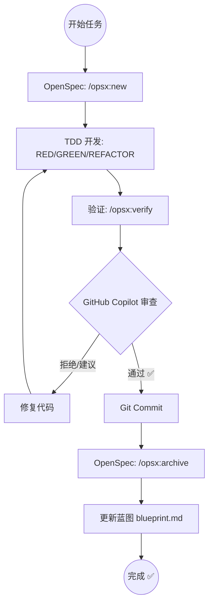

# 开发循环工作流

将 OpenSpec 任务管理、TDD 开发和基于 GitHub Copilot 的代码审查组合为完整的开发循环。

## 配置

```yaml
review_model: "GPT-5.2-Codex" # 默认审查模型
max_review_cycles: 3          # 审查循环最大次数
auto_commit: true             # 通过后自动提交
update_blueprint: true        # 完成后更新蓝图
use_openspec: true            # 是否使用 OpenSpec
```

---

## 阶段 1: 准备与开发 (OpenSpec & TDD)

### 1.1 初始化变更 (OpenSpec)
如果是一个新功能，启动一个新的 OpenSpec change：
```bash
/opsx:new <feature-name> --schema spec-driven
/opsx:ff
```

### 1.2 TDD 开发循环
按照 `workflows/laravel-tdd-dev.md` 进行开发：
1. 领取任务：从 `openspec/changes/<change-name>/tasks.md` 选取任务。
2. 编写测试 (RED)。
3. 实现代码 (GREEN)，使用 `skills/shadcn-ui` 进行 UI 开发。
4. 重构 (REFACTOR)。
5. 标记任务完成并验证：
```bash
/opsx:verify
```

---

## 阶段 2: 代码审查 (GitHub Copilot)

开发完成后，调用 GitHub Copilot 进行深度代码审核。

### 2.1 运行审查
使用指定的模型进行审核（默认使用 `review_model` 配置）：

```bash
# 自动输出审查结论到 docs/reviews/review-xxxx.md
gh copilot suggest "Review the current changes in HEAD compared to main. Use model $review_model if provided."
```

### 2.2 规定输出格式
审核输出**必须**包含以下部分：

1. **审核结论**：`通过 ✅` | `建议修改 ⚠️` | `拒绝 ❌ (需修复)`
2. **问题清单**：
   - **优先级**：Critical / High / Medium / Low
   - **位置**：文件路径及代码行号
   - **描述**：逻辑错误、安全隐患、性能瓶颈或规范偏离
3. **修复建议**：具体的代码重构方案 or 最佳实践引用。
4. **网络查询建议**：针对疑难问题，提供 2-3 个搜索引擎关键词（如：`Laravel PostgreSQL upsert race condition fix`）。

### 2.3 自动修复循环
根据 `workflows/code-review.md` 进行自动修复。

---

## 阶段 3: 完成与同步

### 3.1 归档变更 (OpenSpec)
审核通过后，同步并归档 OpenSpec 记录：
```bash
/opsx:archive
```

### 3.2 更新蓝图
调用 `/blueprint --scan` 或同步蓝图进度，确保 `blueprint.md` 记录了最新的功能状态。

---

## 完整流程图



---

## 产出

- ✅ 符合 OpenSpec 规范的变更记录
- ✅ 通过 TDD 和 GitHub Copilot 验证的高质量代码
- ✅ 包含修复建议和网络查询建议的审查报告
- ✅ 实时更新的项目蓝图
- ✅ 规范的 Git 提交记录
